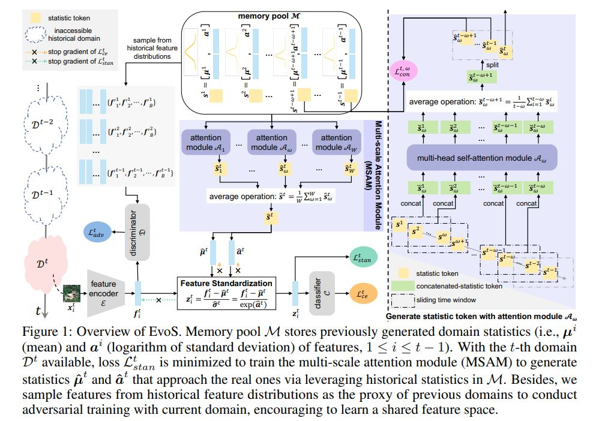

<div align="center">  
  
**Evolving Standardization for Continual Domain
Generalization over Temporal Drift [NeurIPS 2023]**

[](https://openreview.net/pdf?id=5hVXbiEGXB) &nbsp;&nbsp;
[](https://neurips.cc/media/PosterPDFs/NeurIPS%202023/72789.png?t=1699178033.6299655) &nbsp;&nbsp;

</div>

<!-- TOC -->

- [Overview](#overview)
- [Prerequisites Installation](#prerequisites-installation)
- [Datasets Preparation](#datasets-preparation)
- [Code Running](#code-running)
- [Acknowledgments](#acknowledgments)
- [Citation](#citation)

<!-- /TOC -->

## Overview

We formulate a promising but challenging problem of continual domain generalization over temporal drift (CDGTD) and propose an *Evolving Standardization (EvoS)* approach for CDGTD. EvoS characterizes the evolving pattern and further achieves generalization by conducting the feature standardization.



## Prerequisites Installation

* The code is implemented with `Python 3.7.16`, `CUDA 12.2`. To try out this project, it is recommended to set up a virtual environment first.

    ```bash
    # Step-by-step installation
    conda create --name evos python=3.7.16
    conda activate evos

    # this installs the right pip and dependencies for the fresh python
    conda install -y ipython pip
  
    # install torch, torchvision and torchaudio
    pip install torch==1.9.1+cu111 torchvision==0.10.1+cu111 torchaudio==0.9.1 -f https://download.pytorch.org/whl/torch_stable.html

    # this installs required packages
    pip install -r requirements.txt
    ```


## Datasets Preparation

- Download [yearbook.pkl](https://drive.google.com/u/0/uc?id=1mPpxoX2y2oijOvW1ymiHEYd7oMu2vVRb&export=download)
- Download [fmow.pkl](https://drive.google.com/u/0/uc?id=1s_xtf2M5EC7vIFhNv_OulxZkNvrVwIm3&export=download) and [fmow_v1.1.tar.gz](https://worksheets.codalab.org/bundles/0xaec91eb7c9d548ebb15e1b5e60f966ab)
- Download [huffpost.pkl]( https://drive.google.com/u/0/uc?id=1jKqbfPx69EPK_fjgU9RLuExToUg7rwIY&export=download)
- Download [arxiv.pkl](https://drive.google.com/u/0/uc?id=1H5xzHHgXl8GOMonkb6ojye-Y2yIp436V&export=download)
- rmnist will automatically download while running the code.

The data folder should be structured as follows:
    
    ```
    ├── datasets/
    │   ├── yearbook/     
    |   |   ├── yearbook.pkl
    │   ├── rmnist/
    |   |   ├── MNIST/
    |   |   ├── rmnist.pkl
    │   ├── huffpost/	
    |   |   ├── huffpost.pkl
    │   ├── fMoW/	
    |   |   ├── fmow_v1.1/
    |   |   |   |── images/
    |   |   |—— fmow.pkl
    │   ├── arxiv/	
    |   |   ├── arxiv.pkl
    ```

## Code Running

* for **Eval-Fix** manner:

    ```bash
    # running for yearbook dataset:
    sh script_yearbook_eval_fix.sh
    
    # running for rmnist dataset:
    sh script_rmnist_eval_fix.sh
  
    # running for fmow dataset:
    sh script_fmow_eval_fix.sh
  
    # running for huffpost dataset:
    sh script_huffpost_eval_fix.sh
  
    # running for arxiv dataset:
    sh script_arxiv_eval_fix.sh

    ```

* for **Eval-Stream** manner:
    ```bash
    # running for yearbook dataset:
    sh script_yearbook_eval_stream.sh
    
    # running for huffpost dataset:
    sh script_huffpost_eval_stream.sh
    ```

## Acknowledgments

This project is mainly based on the open-source project: [Wild-Time](https://github.com/huaxiuyao/Wild-Time). We thank its authors for making the source code publicly available.


## Citation

If you find this work helpful to your research, please consider citing the paper:

```bibtex
@inproceedings{xie2023evos,
  title={Evolving Standardization for Continual Domain Generalization over Temporal Drift},
  author={Mixue Xie, Shuang Li, Longhui Yuan, Chi Harold Liu, Zehui Dai},
  booktitle={Advances in Neural Information Processing Systems (NeurIPS)},
  year={2023}
}
```

